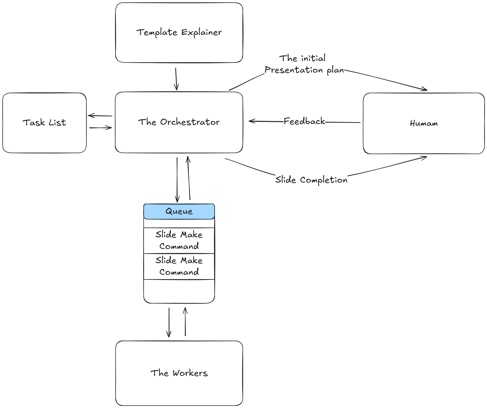

# Slide Agent
## Goal 
Given a template and some content automatically convert the content into slides in the format of the template.

## High Level Architechture
To achive this we will be using the following high level architecture
<!--  -->

The system starts off with the user giving the system a template they want to build their ppt in, we pass it to an llm to understand all the layouts on the slides and we write textual explainations for our orchestrator.

The Orchestrator is the main brain of the system it will take in the users content and textual descriptions of the layouts, first it will create a plan where it will organize the content into slides and also output the layout to use out of all the available options. In the plan it will also mention what content goes into which type of layout box (the title will go to the title). The user will need to approve the plan  or give the agent feedback to improve the design. After the plan is approved the orchestrator will start adding slide make requests to the queue. We will be able to make the worker agents work on a single slide in parallel. 

The worker agent will recive all the relevent context related to the slide only, it will convert the plan for that slide to tool calls. Because the process is not that complicated and the orechestrator did all the heavy work the worker will make sure that the request that the orchestrator made is correct If there are any errors it will correct the request. It will try the api call for a max of 5 times. It will let the orchestrator know weather it failed or passed with an explaination of what it did.

If the request passed the user will be told to check the slide and asked to give feedback. If the operations did not work the user will have the choice to tell the agent what to do or make the failed slides personally.

To make sure that a check is kept on the progress the orchestrator will maintain a tasklist which it will update based on the feedback from the worker and human.
## [detailed system diagram](./docs/sw/system_diagram.png)
## [data model](./docs/sw/dataModel.md)
The  data will be stored in a mongo DB

## Role of LLMs
To make sure that the system is reliable and low latency, most of the system is deterministic and does not rely on llm direction. However with that being said, LLMs are the main brain of this system. 

The LLM plays its first major role by helping build understanding about the layout. If we just provide raw template information to an llm to make the planing it will be a lot of mental load onto 1 llm. Furthermore buy spliting this task we ensure that the LLM used for understanding the template is hyper focused on understanding and explaining what the template means.

We will use this template explaination and user provided content to plan out the presentation. The planer agent will then present the plan to the user and get validation. It will then create tasks that will be put into a queue and picked up by the worker agents for parallel execution.

The worker agent is a seprate entity, this is done to serve 3 main purpouses:
1. **Parallelization**: We can run multiple instances at the same time
2. **Optimization**: We can control the context and provide hyper specifc context to ensure efficiency and accuracy
3. **Specialization**: Becuase the agent would be doing some very specific work we could ensure that it is tunened to achive its goals, furhtermore when we want to deal with different modalities on the slide we can have different prompts the whole system is modular

Becuase the worker agents are all modular and the failure of one of the agents will not affect the other agents the system as a whole will  be fault tollerent.
