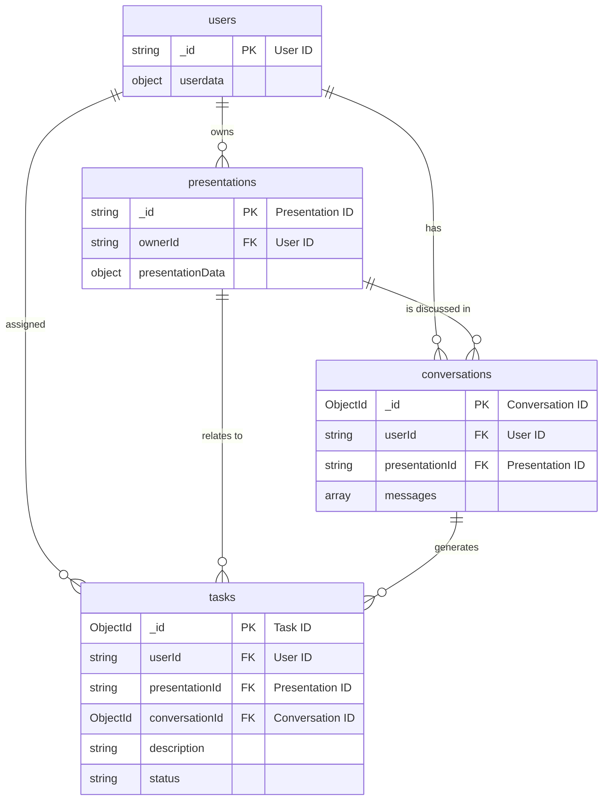

# Data Model
## Database Schema Overview
Our database consists of the following main collections:
* `users`: Stores information about our application's users, including their authentication details.
* `presentations`: Stores the complete JSON data from the Google Slides API for each presentation, along with our own custom metadata.
* `tasks`: stores the the tasks that the planer plans to complete. Each entry will be a task
* `conversations`: This will be used to maintain conversation history for the users 

*this table has been abstracted for simplicity