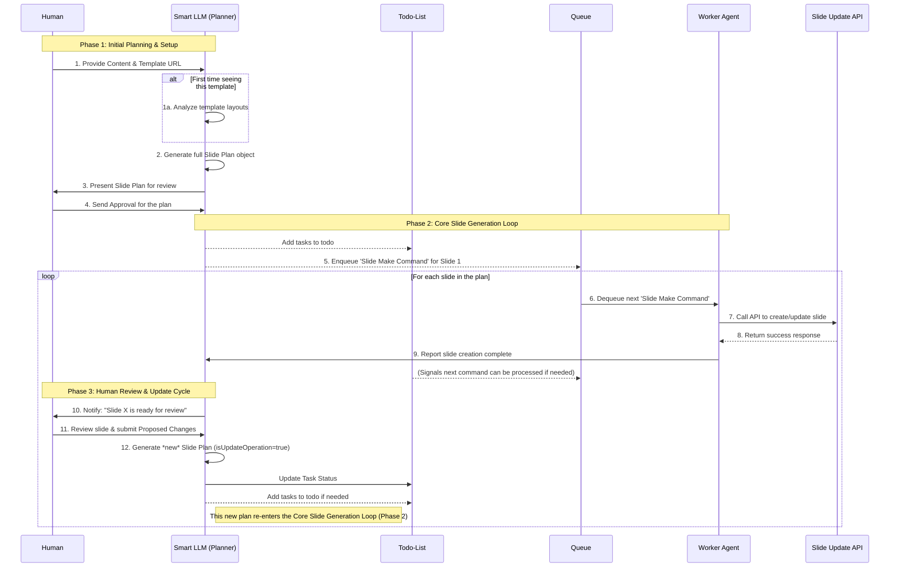

```mermaid
sequenceDiagram
    %% Define all participants in the workflow
    participant H as Human
    participant P as Smart LLM (Planner)
    participant T as Todo-List
    participant Q as Queue
    participant W as Worker Agent
    participant API as Slide Update API
   


    %% Phase 1: Initial Planning and Setup
    Note over H, P: Phase 1: Initial Planning & Setup
    
    H->>P: 1. Provide Content & Template URL

    alt First time seeing this template
        P->>P: 1a. Analyze template layouts
    end

    P->>P: 2. Generate full Slide Plan object
    P->>H: 3. Present Slide Plan for review
    H->>P: 4. Send Approval for the plan

    %% Phase 2: Core Slide Generation Loop
    Note over P, W: Phase 2: Core Slide Generation Loop
    P-->>T: Add tasks to todo

    P-->>Q: 5. Enqueue 'Slide Make Command' for Slide 1

    loop For each slide in the plan
        Q->>W: 6. Dequeue next 'Slide Make Command'
        W->>API: 7. Call API to create/update slide
        API-->>W: 8. Return success response
        W->>P: 9. Report slide creation complete
        T-->>Q: (Signals next command can be processed if needed)
        
    
    %% Phase 3: Human Review and Update Cycle
    Note over H, P: Phase 3: Human Review & Update Cycle
    
    P->>H: 10. Notify: "Slide X is ready for review"
    H->>P: 11. Review slide & submit Proposed Changes
    P->>P: 12. Generate *new* Slide Plan (isUpdateOperation=true)
    P->>T:Update Task Status
    P-->>T: Add tasks to todo if needed
    
    Note right of P: This new plan re-enters the Core Slide Generation Loop (Phase 2) 
    end
    
```
